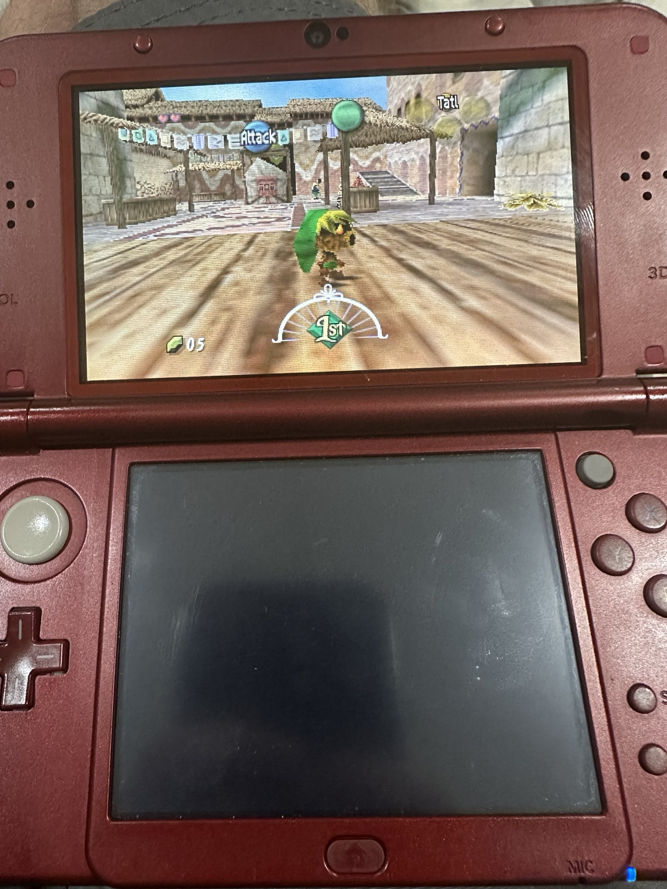
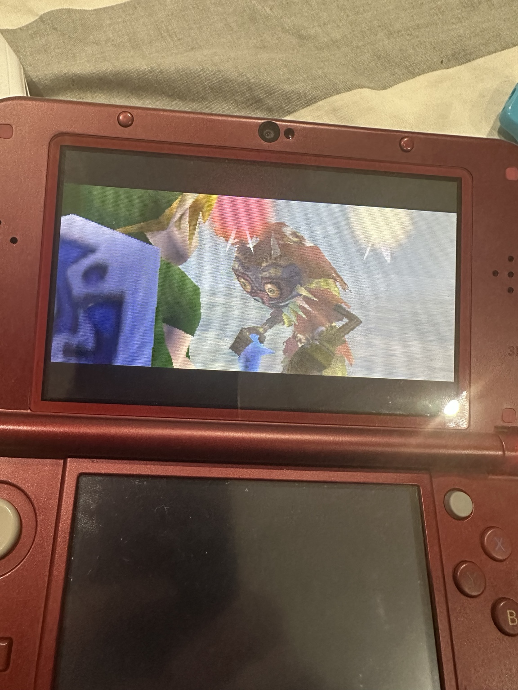

# 2Ship2Harkinian-3DS

Experimental **New Nintendo 3DS port of 2Ship2Harkinian**, the Majora's Mask PC port by Harbour Masters.

 **Important:** this repository currently contains only a partial subset of the 3DS port.

## Current status

2Ship2Harkinian has been successfully brought up on real **New Nintendo 3DS hardware**.

The current development build:

- compiles as `.3dsx` and `.cia`;
- boots and runs on a real New Nintendo 3DS;
- reaches gameplay;
- has a 3D stereoscopic mode;
- is still experimental and not considered a stable release.
  
## Hardware demonstration

The current experimental 2Ship2Harkinian-3DS development build has been tested on real New Nintendo 3DS XL hardware.

These images show the port running directly on real hardware during development:

  
  

> **Development status:** These photographs demonstrate that the current development build boots and executes Majora's Mask gameplay on real New Nintendo 3DS XL hardware. They do not imply full compatibility or stability. The port remains experimental and known issues are still being investigated.
Known issues currently include:

FIXED - heavily distorted and intermittent audio; 

FIXED - missing or incorrectly reproduced sounds/voices; 

FIXED - incorrect pitch for some audio; 

- random crashes while doing Clock Town progression;
- additional compatibility and stability issues are expected.

This is therefore **work in progress**, not a finished or production-ready port.

## Why is only part of the source here?

The working 3DS port was developed using existing 3DS work from **soh-3ds** as an important technical reference/base.

Some parts of the current working tree are derived from or closely related to that work.

Permission to redistribute those portions as part of this project has been requested and is currently unresolved.

For that reason, this repository intentionally publishes **only the subset of the 2Ship3DS work that was retained after comparison against `soh-3ds v0.1.0-alpha.3`**.

Code identified as identical to, copied from, or substantially overlapping with the compared soh-3ds code has intentionally been excluded from this public subset.

This means the repository **does not currently contain the complete source tree required to reproduce the working 3DS build**.

The missing portions will not be published here unless their redistribution status is resolved appropriately.

### Important limitation of this separation

The comparison against `soh-3ds v0.1.0-alpha.3` is a conservative engineering comparison, **not a legal determination of authorship**.

A file being present in this repository means that it survived that comparison and was considered part of the 2Ship-specific work being preserved publicly. It does not, by itself, establish that every individual line in that file was independently authored.

Likewise, some original 2Ship3DS modifications may have been omitted because they existed inside files that also contained code derived from the reference project.

## Purpose of this repository

The immediate goal is to preserve and document the independently developed 2Ship3DS work while development continues.

Longer term, the project aims to provide a functional native New Nintendo 3DS port of 2Ship2Harkinian with:

- stable gameplay;
- proper 3DS input integration;
- functional audio;
- New 3DS-specific rendering;
- `.3dsx` and `.cia` builds;
- hardware-tested compatibility.

## Build status

**The source currently published here is intentionally incomplete and is not expected to build by itself.**

The internal development tree contains additional platform code required for the working hardware build, but those portions are not included in this public repository at this time.

Do not interpret build failures from this public subset as representing the state of the complete development version.

## Hardware

Development and testing are currently focused on:

**New Nintendo 3DS / New Nintendo 3DS XL**

The port should currently be considered **New 3DS-specific**. Compatibility with original Nintendo 3DS hardware is not claimed.

## Upstream projects and credits

This project exists because of substantial work done by other open-source projects and contributors.

### Harbour Masters

**2Ship2Harkinian** is developed by Harbour Masters and its contributors.

2Ship2Harkinian provides the underlying Majora's Mask PC-port codebase on which this project is based.

This repository is an unofficial experimental 3DS port and is not presented as an official Harbour Masters release.

### 999sian / soh-3ds

The existing **soh-3ds** project by **999sian** provided important prior work for running Ship of Harkinian on Nintendo 3DS hardware.

That work was used as a technical reference/base during development of this port.

Code derived from that project is intentionally **not included in the currently published subset** while redistribution permission remains unresolved.

Full credit for that work belongs to 999sian and the corresponding contributors.

### Ship of Harkinian / libultraship contributors

This project also builds upon the broader technical ecosystem created by the Ship of Harkinian, libultraship, and related Harbour Masters contributors.

Their work made this experiment substantially more feasible.

## Game assets

No copyrighted Majora's Mask game assets or ROM are distributed by this repository.

Users are responsible for supplying any legally required game data themselves when applicable.

## Project maturity

This project should currently be treated as:

**Experimental / pre-alpha**

A successful hardware boot does not imply full compatibility.

Expect crashes, missing functionality, incorrect behavior and significant unfinished platform work.

## Repository status

This README describes both:

1. the **complete 2Ship3DS development project**, which has produced hardware-booting builds; and
2. the **restricted public source subset contained in this repository today**.

Those are deliberately not the same thing.

The repository may be expanded later if the redistribution status of the remaining 3DS platform code is resolved.
